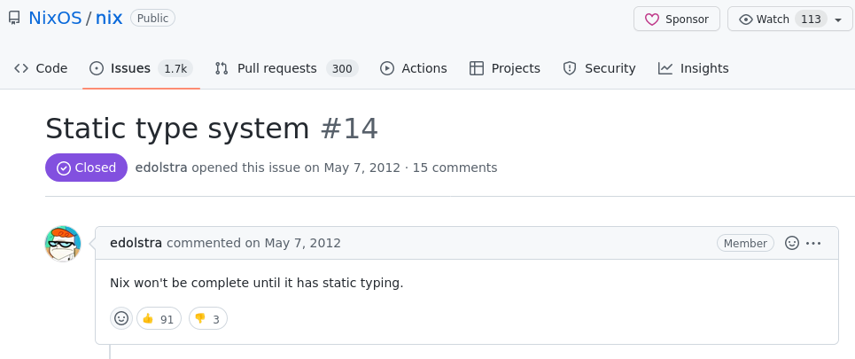

The tale of an old issue\footnote{https://github.com/NixOS/nix/issues/14}...




## Does Nix *really* lack of a type system?

Without a type system, we got really inconsistent errors:
it fails at the last moment often far from where the mistake was actually
made, and reading stack trace is often helpless ...


## Nix is designed as a dumb simple language ...

So, Nix invites us to build constructs in library-space!

Looking through the glass of `nixpkgs.lib.types` ... package are
functions, types are functions everything is a
function\footnote{In fact, it's functors!}.


## Is it so bad to have ~~type~~ validator functions?

Nix expression evaluation (with `nix-instantiate`) is guaranteed by
design to terminate.

As unfair comparison: C++ template resolution could loop infinitely ...


## `yants` and `contracts`

I wrote
`contracts`\footnote{https://github.com/yvan-sraka/contracts}
(100 LoC) this summer while have quite no internet connection and
realize only later that
`yants`\footnote{https://code.tvl.fyi/about/nix/yants} (by `@tazjin`)
already exist.

Fun fact, there are really similar! At the point, I wrote just before
this talk a `contract.yants` compatibility set.


## Example of a simple `contract`

```nix
let Login = declare { name = "Login"; }
                    { user = Email; password = Hash; };

    users = contract { name = "valid users.json format"; }
                     (listOf Login) # defined just before!
                     (builtins.fromJSON
                        (builtins.readFile ./users.json));
```


## Implementations differences

-   Some usability differences: `yants` have `struct` and `enum`
    keywords while `contracts` have a `def` one that help user define
    composable requirement as data.

-   `yants` fail on not required attribute set fields while `contracts`
    allow them!

-   `contracts` does not rely on `nixpkgs` (`yants` does).

-   You can reuse types defined `nixpkgs.lib.type` in `contracts` and
    use `contracts` types as NixOS options.


## Recoverable errors!

```
nix-repl> json = "{}" # e.g. of a bad users.json file!
nix-repl> users = map (x: x.user) (builtins.fromJSON json)
nix-repl> builtins.tryEval users
```

This code will fail with this error (which is unrecoverable) …

```
error: value is a set while a list was expected
```

`contracts` and `yants` solve that :)


## Conclusion

You should use runtime type constructs! That one sane way to save
yourself while debugging expressions (rather than just rely on
`builtins.trace builtins.deepSeq`). You can opt in really progressively
and opt-out in a snap.

Does it really solve the problem? It's incomplete ... but there are
alternatives, e.g. starting a new thing from scratch:
other configuration languages with typing
`cue`\footnote{https://cuelang.org/},
`dahl`\footnote{https://dhall-lang.org/},
`nickel`\footnote{https://nickel-lang.org/}, that generates JSON
and already lives in `nixpkgs`.

I personally have a lot of affection for
`purenix`\footnote{https://github.com/purenix-org/purenix} that
outputs nix code.


# \Huge Q/A
